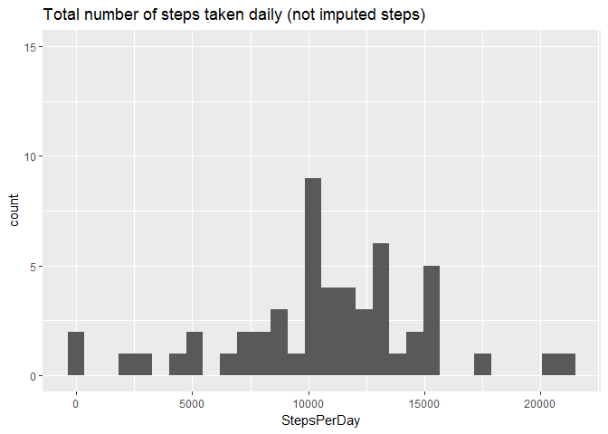
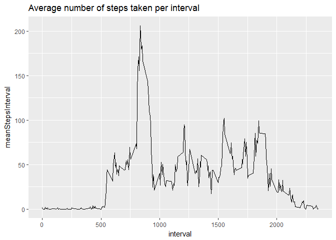
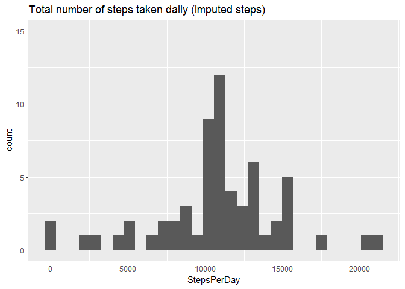
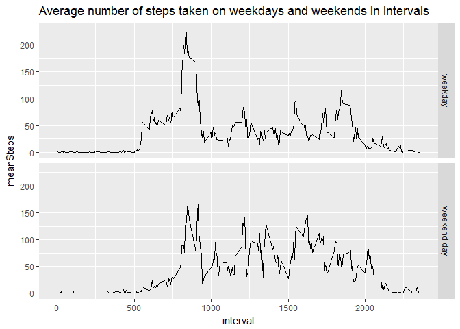

## Load some libraries needed

```r
library(dplyr)
```

```
## Warning: package 'dplyr' was built under R version 3.4.3
```

```
## 
## Attaching package: 'dplyr'
```

```
## The following objects are masked from 'package:stats':
## 
##     filter, lag
```

```
## The following objects are masked from 'package:base':
## 
##     intersect, setdiff, setequal, union
```

```r
library(ggplot2)
```

```
## Warning: package 'ggplot2' was built under R version 3.4.4
```

```r
library(lubridate)
```

```
## Warning: package 'lubridate' was built under R version 3.4.4
```

```
## 
## Attaching package: 'lubridate'
```

```
## The following object is masked from 'package:base':
## 
##     date
```

## Loading and preprocessing the data

```r
# 1. Load the data (i.e.read.csv())
dat <- read.csv(unz("activity.zip", "activity.csv"), sep = ",")

# 2. Process/transform the data (if necessary) into a format suitable for your 
# analysis
# -> set dates to date format
str(dat)
```

```
## 'data.frame':	17568 obs. of  3 variables:
##  $ steps   : int  NA NA NA NA NA NA NA NA NA NA ...
##  $ date    : Factor w/ 61 levels "2012-10-01","2012-10-02",..: 1 1 1 1 1 1 1 1 1 1 ...
##  $ interval: int  0 5 10 15 20 25 30 35 40 45 ...
```

```r
dat$date <- as.Date(dat$date)
str(dat)
```

```
## 'data.frame':	17568 obs. of  3 variables:
##  $ steps   : int  NA NA NA NA NA NA NA NA NA NA ...
##  $ date    : Date, format: "2012-10-01" "2012-10-01" ...
##  $ interval: int  0 5 10 15 20 25 30 35 40 45 ...
```

## What is mean total number of steps taken per day?

For this part of the assignment, you can ignore the missing values in the dataset.


```r
# 1. Calculate the total number of steps taken per day 
dat_stepsDay <- dat %>% group_by(date) %>% 
  summarise(StepsPerDay = sum(steps))

# 2. If you do not understand the difference between a histogram and a barplot, 
# research the difference between them. Make a histogram of the total number of
# steps taken each day
ggplot2::ggplot(dat_stepsDay, aes(StepsPerDay)) + 
  geom_histogram() + 
  ggtitle("Total number of steps taken daily (not imputed steps)") +
  ylim(0, 15)
```

```
## `stat_bin()` using `bins = 30`. Pick better value with `binwidth`.
```

```
## Warning: Removed 8 rows containing non-finite values (stat_bin).
```

<!-- -->

```r
# 3. Calculate and report the mean and median of the total number of steps taken
# per day
report <- dat %>% group_by(date) %>% 
  summarise(meanStepsDay = mean(steps), medianStepsDay = median(steps))
```

```
## Warning: package 'bindrcpp' was built under R version 3.4.4
```

```r
report
```

```
## # A tibble: 61 x 3
##    date       meanStepsDay medianStepsDay
##    <date>            <dbl>          <dbl>
##  1 2012-10-01       NA                 NA
##  2 2012-10-02        0.438              0
##  3 2012-10-03       39.4                0
##  4 2012-10-04       42.1                0
##  5 2012-10-05       46.2                0
##  6 2012-10-06       53.5                0
##  7 2012-10-07       38.2                0
##  8 2012-10-08       NA                 NA
##  9 2012-10-09       44.5                0
## 10 2012-10-10       34.4                0
## # ... with 51 more rows
```


## What is the average daily activity pattern?


```r
# 1. Make a time series plot (i.e. type = "l") of the 5-minute interval (x-axis)
# and the average number of steps taken, averaged across all days (y-axis)
dat_stepsInterval <- dat %>% group_by(interval) %>% 
  summarise(meanStepsInterval = mean(steps, na.rm = TRUE))

dat_stepsInterval %>%
  ggplot(aes(x = interval, y = meanStepsInterval)) + 
  geom_line() + 
  ggtitle("Average number of steps taken per interval")
```

<!-- -->

```r
# 2. Which 5-minute interval, on average across all the days in the dataset, 
# contains the maximum number of steps?
dat_stepsInterval[dat_stepsInterval$meanStepsInterval == 
                    (max(dat_stepsInterval$meanStepsInterval)), "interval"]
```

```
## # A tibble: 1 x 1
##   interval
##      <int>
## 1      835
```


## Imputing missing values

Note that there are a number of days/intervals where there are missing values
(coded as \color{red}{\verb|NA|}NA). The presence of missing days may introduce
bias into some calculations or summaries of the data.


```r
# 1. Calculate and report the total number of missing values in the dataset
# (i.e. the total number of rows with |NA|)
summary(dat)
```

```
##      steps             date               interval     
##  Min.   :  0.00   Min.   :2012-10-01   Min.   :   0.0  
##  1st Qu.:  0.00   1st Qu.:2012-10-16   1st Qu.: 588.8  
##  Median :  0.00   Median :2012-10-31   Median :1177.5  
##  Mean   : 37.38   Mean   :2012-10-31   Mean   :1177.5  
##  3rd Qu.: 12.00   3rd Qu.:2012-11-15   3rd Qu.:1766.2  
##  Max.   :806.00   Max.   :2012-11-30   Max.   :2355.0  
##  NA's   :2304
```

```r
# -> All the missing values occure in steps.
sum(is.na(dat$steps))
```

```
## [1] 2304
```

```r
# 2. Devise a strategy for filling in all of the missing values in the dataset. 
# The strategy does not need to be sophisticated. For example, you could use the
# mean/median for that day, or the mean for that 5-minute interval, etc.
# -> Impute missing values by the mean for the specific 5-minute interval.

# 3. Create a new dataset that is equal to the original dataset but with the
# missing data filled in.
dat_withoutNAs <- dat
dat_withoutNAs$steps <- ifelse(is.na(dat_withoutNAs$steps), 
                               dat_stepsInterval$meanStepsInterval, dat$steps)

# 4. a) Make a histogram of the total number of steps taken each day...
dat_withoutNAs_stepsDay <- dat_withoutNAs %>% group_by(date) %>%
  summarise(StepsPerDay = sum(steps))

ggplot2::ggplot(dat_withoutNAs_stepsDay, aes(StepsPerDay)) + 
  geom_histogram() + 
  ggtitle("Total number of steps taken daily (imputed steps)") +
  ylim(0, 15)
```

```
## `stat_bin()` using `bins = 30`. Pick better value with `binwidth`.
```

<!-- -->

```r
# b) ...and Calculate and report the mean and median total number of steps taken
# per day.
report_withoutNAs <- dat_withoutNAs %>% group_by(date) %>%
  summarise(meanStepsDay = mean(steps), medianStepsDay = median(steps))
report_withoutNAs
```

```
## # A tibble: 61 x 3
##    date       meanStepsDay medianStepsDay
##    <date>            <dbl>          <dbl>
##  1 2012-10-01       37.4             34.1
##  2 2012-10-02        0.438            0  
##  3 2012-10-03       39.4              0  
##  4 2012-10-04       42.1              0  
##  5 2012-10-05       46.2              0  
##  6 2012-10-06       53.5              0  
##  7 2012-10-07       38.2              0  
##  8 2012-10-08       37.4             34.1
##  9 2012-10-09       44.5              0  
## 10 2012-10-10       34.4              0  
## # ... with 51 more rows
```

```r
# c) Do these values differ from the estimates from the first part of the
# assignment?
# -> t-test on meanStepsDay
t.test(report$meanStepsDay, report_withoutNAs$meanStepsDay)
```

```
## 
## 	Welch Two Sample t-test
## 
## data:  report$meanStepsDay and report_withoutNAs$meanStepsDay
## t = 0, df = 107.14, p-value = 1
## alternative hypothesis: true difference in means is not equal to 0
## 95 percent confidence interval:
##  -5.344249  5.344249
## sample estimates:
## mean of x mean of y 
##   37.3826   37.3826
```

```r
# p-value > 0.05 -> No significant difference (that's not surprising since I 
# imputed with the mean values)

# -> t-test on medianStepsDay
t.test(report$medianStepsDay, report_withoutNAs$medianStepsDay)
```

```
## 
## 	Welch Two Sample t-test
## 
## data:  report$medianStepsDay and report_withoutNAs$medianStepsDay
## t = -3.0094, df = 60, p-value = 0.003824
## alternative hypothesis: true difference in means is not equal to 0
## 95 percent confidence interval:
##  -7.447546 -1.500180
## sample estimates:
## mean of x mean of y 
##  0.000000  4.473863
```

```r
# p-value < 0.05 -> significant difference

# d) What is the impact of imputing missing data on the estimates of the total 
# daily number of steps?
# -> t-test on StepsPerDay
t.test(dat_stepsDay$StepsPerDay, dat_withoutNAs_stepsDay$StepsPerDay)
```

```
## 
## 	Welch Two Sample t-test
## 
## data:  dat_stepsDay$StepsPerDay and dat_withoutNAs_stepsDay$StepsPerDay
## t = 0, df = 107.14, p-value = 1
## alternative hypothesis: true difference in means is not equal to 0
## 95 percent confidence interval:
##  -1539.144  1539.144
## sample estimates:
## mean of x mean of y 
##  10766.19  10766.19
```

```r
# p-value > 0.05 -> No significant difference (that's not surprising too since I
# imputed with the mean values)
```


## Are there differences in activity patterns between weekdays and weekends?

For this part the \color{red}{\verb|weekdays()|}weekdays() function may be of 
some help here. Use the dataset with the filled-in missing values for this part.


```r
# 1. Create a new factor variable in the dataset with two levels – “weekday” and 
# “weekend” indicating whether a given date is a weekday or weekend day.
dat_withoutNAs_day <- dat_withoutNAs
dat_withoutNAs_day$dayOfWeek <- lubridate::wday(dat_withoutNAs_day$date)
dat_withoutNAs_day$week <- as.factor(ifelse(dat_withoutNAs_day$dayOfWeek == 1 |
                                              dat_withoutNAs_day$dayOfWeek == 7,
                                            "weekend day", "weekday"))

# 2. Make a panel plot containing a time series plot (i.e. type = "l") of the 
# 5-minute interval (x-axis) and the average number of steps taken, averaged 
# across all weekday days or weekend days (y-axis). See the README file in the 
# GitHub repository to see an example of what this plot should look like using 
# simulated data.

# -> average across weekday and weekend days
dat_withoutNAs_day_agg <- dat_withoutNAs_day %>%
  group_by(interval, week) %>%
  summarise(meanSteps = mean(steps))

# I don't scale (standardize) the steps since nothing is written.

# -> panel plot
dat_withoutNAs_day_agg %>% 
  ggplot(aes(interval, meanSteps)) + 
  geom_line() + 
  facet_grid(week ~ .) +
  ggtitle("Average number of steps taken on weekdays and weekends in intervals")
```

<!-- -->

